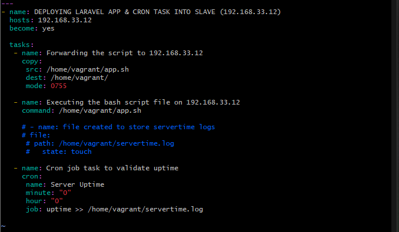

# Objective

- Automate the provisioning of two Ubuntu-based servers, named “Master” and “Slave”, using Vagrant.
- On the Master node, create a bash script to automate the deployment of a LAMP (Linux, Apache, MySQL, PHP) stack.
- This script should clone a PHP application from GitHub, install all necessary packages, and configure Apache web server and MySQL. 
- Ensure the bash script is reusable and readable.

**Using an Ansible playbook:**

- Execute the bash script on the Slave node and verify that the PHP application is accessible through the VM’s IP address (take screenshot of this as evidence)
- Create a cron job to check the server’s uptime every 12 am.


**PHP Laravel GitHub Repository:**

https://github.com/laravel/laravel

# PROJECT STEPS :-

- It is important first of all to configure your Master Ubuntu-based Servers. Install your virtual machine and run the command, ```vagrant init ubuntu/focal64```. But before you do a ```vagrant up```, open the configuration file, ```vim Vagrantfile``` and make sure to configure the uncommented parts of this vagrantfile as seen below;


1. Go to your web browser, input the ip address of your master node and you should be greeted with the laravel homepage interface below;


2. Go to your web browser, input the ip address of your slave node and you should be greeted with the laravel homepage interface below;


3. Then create your playbook that will be used to execute your bashscript on the slave server. Run the playbook with the command; ```ansible-playbook -i host playbook.yaml```. Always replace the 'host' with whatever title you gave to your inventory file. Below this is screen of the successful running of the playbook..
